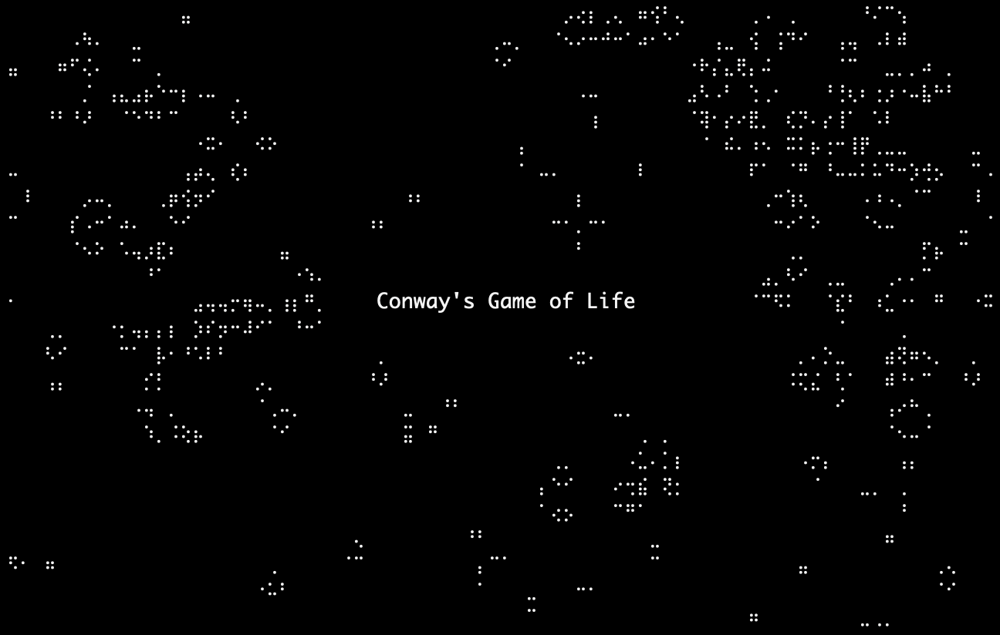

# TextCanvas


[](https://crates.io/crates/textcanvas)
[](https://github.com/qrichert/textcanvas/actions)

TextCanvas is an HTML Canvas-like surface that can be used to draw to
the terminal. Other use cases include visual checks for mathematical
computations (i.e. does the graph at least look correct?), or snapshot
testing (may not be the most accurate, but can have great documentation
value).

It is inspired by drawille[^1], which uses Braille Unicode characters to
increase the resolution of the terminal by a factor of 8 (8 Braille dots
in one terminal character).

The API is inspired by JavaScript's Canvas API.

## Examples

<p align="center">
  
  
  
</p>

```
⠀⠀1⠀⡤⠤⠤⠤⠤⠤⠤⠤⠤⠤⠤⠤⠤⠤⠤⠤⠤⠤⠤⠤⠤⠤⠤⠤⢤⠀⠀⠀⠀⠀⠀⠀⠀⠀⠀⠀⠀⠀⠀⠀⠀⠀⠀⠀⠀⠀⠀⠀⠀⠀⠀⠀⠀⠀⠀⠀⠀⠀⠀⠀⠀⠀⠀⠀⠀⠀⠀⠀⠀⠀⠀⠀⠀⠀⠀⠀
⠀⠀⠀⠀⡇⠉⠉⠢⢄⠀⠀⠀⠀⠀⠀⠀⠀⠀⠀⠀⠀⠀⠀⠀⠀⠀⠀⠀⢸⠀⠀⠀⠀⠀⠀⠀⠀⠀⠀⠀⠀⠀⠀⠀⠀⠀⠀⠀⠀⠀⠀⠀⠀⠀⠀⠀⠀⠀⠀⠀⠑⠢⣀⠀⠀⠀⠀⠀⠀⠀⠀⠀⠀⠀⠀⠀⠀⠀⠀⠀
⠀⠀⠀⠀⡇⠀⠀⠀⠀⠱⡀⠀⠀⠀⠀⠀⠀⠀⠀⠀⠀⠀⠀⠀⠀⠀⠀⠀⢸⠀⠀⠀⠀⠀⠀⠀⠀⠀⠀⠀⠀⠀⠀⠀⠀⠀⠀⠀⠀⠀⠀⠀⠀⠀⠀⠀⠀⠀⠀⠀⠀⠀⠀⠑⠢⣀⠀⠀⠀⠀⠀⠀⠀⠀⠀⠀⠀⠀⠀⠀
⠀⠀⠀⠀⡇⠀⠀⠀⠀⠀⠈⢆⠀⠀⠀⠀⠀⠀⠀⠀⠀⠀⠀⠀⠀⠀⢀⠖⢸⠀⠀⠀⠀⠀⠀⠀⠀⠀⠀⠀⠀⠀⠀⠀⠀⠀⠀⣀⢤⠢⡀⠀⠀⠀⠀⠀⠀⠀⠀⠀⠀⠀⠀⠀hello,⠢world⠀⠀⠀⠀
⠀⠀⠀⠀⡇⠀⠀⠀⠀⠀⠀⠀⠣⡀⠀⠀⠀⠀⠀⠀⠀⠀⠀⠀⠀⡠⠃⠀⢸⠀⠀⠀⠀⠀⠀⠀⠀⠀⠀⠀⠀⠀⠀⣀⠤⠒⠉⢠⠃⠀⠈⠢⡀⠀⠀⠀⠀⠀⠀⠀⠀⠀⠀⠀⠀⠀⠀⠀⠀⠀⠀⠀⠉⠢⢄⠀⠀⠀⠀⠀
⠀⠀⠀⠀⡇⠀⠀⠀⠀⠀⠀⠀⠀⠑⡄⠀⠀⠀⠀⠀⠀⠀⠀⠀⡰⠁⠀⠀⢸⠀⠀⠀⠀⠀⠀⠀⠀⠀⠀⢀⠤⠒⠉⠀⠀⠀⡠⠃⠀⠀⠀⠀⠘⢄⠀⠀⠀⠀⠀⠀⠀⠀⠀⠀⠀⠀⠀⠀⠀⠀⠀⠀⠀⠀⠀⠉⠢⢄⠀⠀
⠀⠀⠀⠀⡇⠀⠀⠀⠀⠀⠀⠀⠀⠀⠈⠢⡀⠀⠀⠀⠀⠀⢀⠔⠁⠀⠀⠀⢸⠀⠀⠀⠀⠀⠀⠀⠀⠀⢠⠃⠑⠢⡀⠀⠀⡰⠁⠀⠀⠀⠀⠀⠀⠀⠑⢄⠀⠀⠀⠀⠀⠀⠀⠀⠀⠀⠀⠀⠀⠀⠀⠀⠀⠀⠀⠀⠀⠀⠀⠀
⠀⠀⠀⠀⡇⠀⠀⠀⠀⠀⠀⠀⠀⠀⠀⠀⠈⠢⠤⡠⠤⠒⠁⠀⠀⠀⠀⠀⢸⠀⠀⠀⠀⠀⠀⠀⠀⡠⠃⠀⠀⠀⠈⠢⣴⠁⠀⠀⠀⠀⠀⠀⠀⠀⠀⠀⠑⢄⠀⠀⠀⠀⠀⠀⠀⠀⠀⠀⠀⠀⠀⠀⠀⠀⠀⠀⠀⠀⠀⠀
⠀-1⠀⠓⠒⠒⠒⠒⠒⠒⠒⠒⠒⠒⠒⠒⠒⠒⠒⠒⠒⠒⠒⠒⠒⠒⠒⠚⠀⠀⠀⠀⠀⠀⠀⡰⠁⠀⠀⠀⠀⠀⡔⠁⠑⠤⡀⠀⠀⠀⠀⠀⠀⠀⠀⠀⠀⠑⡄⠀⠀⠀⠀⠀⠀⠀⠀⠀⠀⠀⠀⠀⠀⠀⠀⠀⠀⠀⠀
⠀⠀⠀⠀0⠀⠀⠀⠀⠀⠀⠀⠀⠀⠀⠀⠀⠀⠀⠀⠀⠀⠀⠀⠀⠀⠀⠀⠀5⠀⠀⠀⠀⠀⡴⠁⠀⠀⠀⠀⠀⡜⠀⠀⠀⠀⠈⠢⣀⠀⠀⠀⠀⠀⠀⠀⠀⠀⠈⠢⡀⠀⠀⠀⠀⠀⠀⠀⠀⠀⠀⠀⠀⠀⠀⠀⠀⠀⠀
⠀⠀⠀⠀⠀⠀⠀⠀⠀⠀⠀⠀⠀⠀⠀⠀⠀⠀⠀⠀⠀⠀⠀⠀⠀⠀⠀⠀⠀⠀⠀⠀⠀⠀⡜⠀⠀⠀⠀⠀⢀⠜⠀⠀⠀⠀⠀⠀⠀⠀⡵⠒⠒⠒⠒⠒⠲⠤⠤⠤⠤⠬⢦⠀⠀⠀⠀⠀⠀⠀⠀⠀⠀⠀⠀⠀⠀⠀⠀⠀
⠀⠀⠀⠀⠀⠀⠀⠀⠀⠀⠀⠀⠀⠀⠀⠀⠀⠀⠀⠀⠀⠀⠀⠀⠀⠀⠀⠀⠀⠀⠀⠀⢀⠜⠀⠀⠀⠀⠀⢀⠎⠀⠀⠀⠀⠀⠀⠀⠀⡼⠁⠀⠀⠀⠀⠀⠀⠀⠀⠀⠀⢠⠃⠀⠀⠀⠀⠀⠀⠀⠀⠀⠀⠀⠀⠀⠀⠀⠀⠀
⠀⠀⠀⠀⠀⠀⠀⠀⠀⠀⠀⠀⠀⠀⠀⠀⠀⠀⠀⠀⠀⠀⠀⠀⠀⠀⠀⠀⠀⠀⠀⢀⠎⠀⠀⠀⠀⠀⢀⠎⠀⠀⠀⠀⠀⠀⠀⠀⡼⠁⠀⠀⠀⠀⠀⠀⠀⠀⠀⠀⢠⠃⠀⠀⠀⠀⠀⠀⠀⠀⠀⠀⠀⠀⠀⠀⠀⠀⠀⠀
⠀⠀⠀⠀⠀⠀⠀⠀⠀⠀⠀⠀⠀⠀⠀⠀⠀⠀⠀⠀⠀⠀⠀⠀⠀⠀⠀⠀⠀⠀⠀⠪⣄⡀⠀⠀⠀⢠⠊⠀⠀⠀⠀⠀⠀⠀⠀⡼⠁⠀⠀⠀⠀⠀⠀⠀⠀⠀⠀⢀⠎⠀⠀⠀⠀⠀⠀⠀⠀⠀⠀⠀⠀⠀⠀⠀⠀⠀⠀⠀
⠀⠀⠀⠀⠀⠀⠀⠀⠀⠀⠀⠀⠀⠀⠀⠀⠀⠀⠀⠀⠀⠀⠀⠀⠀⠀⠀⠀⠀⠀⠀⠀⠈⠪⡑⠢⢤⡃⠀⠀⠀⠀⠀⠀⠀⠀⡼⠁⠀⠀⠀⠀⠀⠀⠀⠀⠀⠀⢀⠎⠀⠀⠀⠀⠀⠀⠀⠀⠀⠀⠀⠀⠀⠀⠀⠀⠀⠀⠀⠀
⠀⠀⠀⠀⠀⠀⠀⠀⠀⠀⠀⠀⠀⠀⠀⠀⠀⠀⠀⠀⠀⠀⠀⠀⠀⠀⠀⠀⠀⠀⠀⠀⠀⠀⠈⠢⢇⡈⠒⠤⣀⠀⠀⠀⠀⡼⠁⠀⠀⠀⠀⠀⠀⠀⠀⠀⠀⠀⡞⠀⠀⠀⠀⠀⠀⠀⠀⠀⠀⠀⠀⠀⠀⠀⠀⠀⠀⠀⠀⠀
⠀⠀⠀⠀⠀⠀⠀⠀⠀⠀⠀⠀⠀⠀⠀⠀⢀⠀⠀⠀⠀⠀⠀⠀⠀⠀⠀⠀⠀⠀⠀⠀⠀⠀⠀⠀⠀⠈⠑⠢⢄⡉⠒⠤⡼⠁⠀⠀⠀⠀⠀⠀⠀⠀⠀⠀⠀⡜⠀⠀⠀⠀⠀⠀⠀⠀⠀⠀⠀⠀⢀⠀⠀⠀⠀⠀⠀⠀⠀⠀
⠀⠀⠀⠀⠀⠀⠀⠀⠀⠀⠀⠀⠀⢀⡠⠊⠁⠉⠢⣀⠀⠀⠀⠀⠀⠀⠀⠀⠀⠀⠀⠀⠀⠀⠀⠀⠀⠀⠀⠀⠀⠈⠑⠢⢌⡑⠤⡀⠀⠀⠀⠀⠀⠀⠀⠀⡜⠀⠀⠀⠀⠀⠀⠀⠀⠀⠀⠀⢀⣴⣿⣷⣄⠀⠀⠀⠀⠀⠀⠀
⠀⠀⠀⠀⠀⠀⠀⠀⠀⠀⠀⠀⠀⢣⠀⠀⠀⠀⠀⢠⠃⠀⠀⠀⠀⠀⠀⠀⠀⠀⠀⠀⠀⠀⠀⠀⠀⠀⠀⠀⠀⠀⠀⠀⠀⠈⠑⠪⢕⡦⣀⠀⠀⠀⠀⡰⠁⠀⠀⠀⠀⠀⠀⠀⠀⠀⠀⢴⣿⣿⣿⣿⣿⣷⠄⠀⠀⠀⠀⠀
⠀⠀⠀⠀⠀⠀⠀⠀⠀⠀⠀⠀⠀⠀⢇⠀⠀⠀⢀⠎⠀⠀⠀⠀⠀⠀⠀⠀⠀⠀⠀⠀⠀⠀⠀⠀⠀⠀⠀⠀⠀⠀⠀⠀⠀⠀⠀⠀⠀⠈⠑⠳⢦⣀⡰⠁⠀⠀⠀⠀⠀⠀⠀⠀⠀⠀⠀⠀⠙⢿⣿⣿⠟⠁⠀⠀⠀⠀⠀⠀
⠀⠀⠀⠀⠀⠀⠀⠀⠀⠀⠀⠀⠀⠀⠈⠉⠉⠉⠉⠀⠀⠀⠀⠀⠀⠀⠀⠀⠀⠀⠀⠀⠀⠀⠀⠀⠀⠀⠀⠀⠀⠀⠀⠀⠀⠀⠀⠀⠀⠀⠀⠀⠀⠈⠁⠀⠀⠀⠀⠀⠀⠀⠀⠀⠀⠀⠀⠀⠀⠀⠙⠁⠀⠀⠀⠀⠀⠀⠀⠀
⠀⠀⠀⠀⠀⠀⠀⠀⠀⠀⠀⠀⠀⠀⠀⠀⠀⠀⠀⠀⠀⠀⠀⠀⠀⠀⠀⠀⠀⠀⠀⠀⠀⠀⠀⠀⠀⠀⠀⠀⠀⠀⠀⠀⠀⠀⠀⠀⠀⠀⠀⠀⠀⠀⠀⠀⠀⠀⠀⠀⠀⠀⠀⠀⠀⠀⠀⠀⠀⠀⠀⠀⠀⠀⠀⠀⠀⠀⠀⠀
⠀⠀⠀⠀⠀⠀⠀⠀⠀⠀⠀⠀⠀⠀⠀⠀⠀⠀⠀⠀⠀⠀⠀⠀⠀⠀⠀⠀⠀⠀⠀⠀⠀⠀⠀⠀⠀⠀⠀⠀⠀⠀⠀⠀⠀⠀⠀⠀⠀⠀⠀⠀⠀⠀⠀⠀⠀⠀⠀⠀⠀⠀⠀⠀⠀⠀⠀⠀⠀⠀⠀⠀⠀⠀⠀⠀⠀⠀⠀⠀
⠀⠀⠀⠀⠀⠀⠀⠀⠀⠀⠀⠀⠀⠀⠀⠀⠀⠀⠀⠀⠀⠀⠀⠀⠀⠀⠀⠀⠀⠀⠀⠀⠀⠀⠀⠀⠀⠀⠀⠀⠀⠀⠀⠀⠀⠀⠀⠀⠀⠀⠀⠀⠀⠀⠀⠀⠀⠀⠀⠀⠀⠀⠀⠀⠀⠀⠀⠀⠀⠀⠀⠀⠀⠀⠀⠀⠀⠀⠀⠀
```

<details><summary>More examples</summary>
<p>

## Shapes

<table>
<tr><th></th><th>Rust</th><th>Python</th></tr>
<tr><td>

```
⠑⠢⣀⠀⠀⠀⠀⠀⠀⠀⠀⠀⠀⠀⠀
⠀⠀⠀⠑⠢⣀⠀⠀⠀⠀⠀⠀⠀⠀⠀
⠀hello,⠢world⠀⠀
⠀⠀⠀⠀⠀⠀⠀⠀⠀⠉⠢⢄⠀⠀⠀
⠀⠀⠀⠀⠀⠀⠀⠀⠀⠀⠀⠀⠉⠢⢄

⠀⠀⠀⠀⠀⠀⠀⠀⠀⠀⠀⠀⠀⠀⠀ ⠀⠀⠀⠀⠀⠀⠀⠀⠀⠀⠀⠀⠀⠀⠀
⠀⠀⢰⠒⠒⠒⠒⠒⠒⠒⠒⠒⡆⠀⠀ ⠀⠀⢰⣶⣶⣶⣶⣶⣶⣶⣶⣶⡆⠀⠀
⠀⠀⢸⠀⠀⠀⠀⠀⠀⠀⠀⠀⡇⠀⠀ ⠀⠀⢸⣿⣿⣿⣿⣿⣿⣿⣿⣿⡇⠀⠀
⠀⠀⠸⠤⠤⠤⠤⠤⠤⠤⠤⠤⠇⠀⠀ ⠀⠀⠸⠿⠿⠿⠿⠿⠿⠿⠿⠿⠇⠀⠀
⠀⠀⠀⠀⠀⠀⠀⠀⠀⠀⠀⠀⠀⠀⠀ ⠀⠀⠀⠀⠀⠀⠀⠀⠀⠀⠀⠀⠀⠀⠀

⠀⠀⠀⠀⠀⠀⠀⠀⠀⠀⠀⠀⠀⠀⠀ ⠀⠀⠀⠀⠀⠀⠀⠀⠀⠀⠀⠀⠀⠀⠀
⠀⠀⢰⠢⠤⣀⡀⠀⠀⠀⠀⠀⠀⠀⠀ ⠀⠀⢰⣦⣤⣀⡀⠀⠀⠀⠀⠀⠀⠀⠀
⠀⠀⢸⠀⠀⠀⠈⠉⢒⡢⠄⠀⠀⠀⠀ ⠀⠀⢸⣿⣿⣿⣿⣿⣶⡦⠄⠀⠀⠀⠀
⠀⠀⡇⠀⣀⠤⠔⠊⠁⠀⠀⠀⠀⠀⠀ ⠀⠀⣿⣿⣿⠿⠟⠋⠁⠀⠀⠀⠀⠀⠀
⠀⠀⠓⠉⠀⠀⠀⠀⠀⠀⠀⠀⠀⠀⠀ ⠀⠀⠛⠉⠀⠀⠀⠀⠀⠀⠀⠀⠀⠀⠀

⠀⠀⠀⠀⠀⠀⣀⣀⣀⡀⠀⠀⠀⠀⠀ ⠀⠀⠀⠀⠀⠀⣀⣀⣀⡀⠀⠀⠀⠀⠀
⠀⠀⠀⠀⡠⠊⠀⠀⠀⠈⠢⡀⠀⠀⠀ ⠀⠀⠀⠀⣠⣾⣿⣿⣿⣿⣦⡀⠀⠀⠀
⠀⠀⠀⠀⡇⠀⠀⠀⠀⠀⠀⡇⠀⠀⠀ ⠀⠀⠀⠀⣿⣿⣿⣿⣿⣿⣿⡇⠀⠀⠀
⠀⠀⠀⠀⠣⡀⠀⠀⠀⠀⡠⠃⠀⠀⠀ ⠀⠀⠀⠀⠻⣿⣿⣿⣿⣿⡿⠃⠀⠀⠀
⠀⠀⠀⠀⠀⠈⠒⠒⠒⠊⠀⠀⠀⠀⠀ ⠀⠀⠀⠀⠀⠈⠛⠛⠛⠋⠀⠀⠀⠀⠀

⠀⠀⠀⠀⠀⠀⠀⢀⠀⠀⠀⠀⠀⠀⠀ ⠀⠀⠀⠀⠀⠀⠀⢀⠀⠀⠀⠀⠀⠀⠀
⠀⠀⠀⠀⢀⡠⠊⠁⠉⠢⣀⠀⠀⠀⠀ ⠀⠀⠀⠀⠀⢀⣴⣿⣷⣄⠀⠀⠀⠀⠀
⠀⠀⠀⠀⢣⠀⠀⠀⠀⠀⢠⠃⠀⠀⠀ ⠀⠀⠀⠀⢴⣿⣿⣿⣿⣿⣷⠄⠀⠀⠀
⠀⠀⠀⠀⠀⢇⠀⠀⠀⢀⠎⠀⠀⠀⠀ ⠀⠀⠀⠀⠀⠙⢿⣿⣿⠟⠁⠀⠀⠀⠀
⠀⠀⠀⠀⠀⠈⠉⠉⠉⠉⠀⠀⠀⠀⠀ ⠀⠀⠀⠀⠀⠀⠀⠙⠁⠀⠀⠀⠀⠀⠀
```

</td><td>

```rust
let mut canvas = TextCanvas::new(15, 5);
canvas.stroke_line(0, 0, canvas.w(), canvas.h());
canvas.draw_text("hello, world", 1, 2);


let mut canvas = TextCanvas::new(15, 5);
canvas.stroke_rect(5, 5, 20, 10);


let mut canvas = TextCanvas::new(15, 5);
canvas.stroke_triangle(5, 5, 20, 10, 4, 17);


let mut canvas = TextCanvas::new(15, 5);
canvas.stroke_circle(canvas.cx(), canvas.cy(), 7);


let mut canvas = TextCanvas::new(15, 5);
canvas.stroke_ngon(canvas.cx(), canvas.cy(), 7, 5, PI / 2.0);
```

</td><td>

<!-- blacken-docs:off -->

```python
canvas = TextCanvas(15, 5)
canvas.stroke_line(0, 0, canvas.w, canvas.h)
canvas.draw_text("hello, world", 1, 2)


canvas = TextCanvas(15, 5)
canvas.fill_rect(5, 5, 20, 10)


canvas = TextCanvas(15, 5)
canvas.fill_triangle(5, 5, 20, 10, 4, 17)


canvas = TextCanvas(15, 5)
canvas.fill_circle(canvas.cx, canvas.cy, 7)


canvas = TextCanvas(15, 5)
canvas.fill_ngon(canvas.cx, canvas.cy, 7, 4, 0.0)
```

<!-- blacken-docs:on -->

</td></tr>
</table>

## Plots

<table>
<tr><th></th><th>Rust</th><th>Python</th></tr>
<tr><td>

```
⠀⠀⠀⠀⠀⠀⠀⠀⠀⠀⠀⢀⠤⠒⠉ ⠀⠀⠀⠀⠀⠀⠀⠀⠀⠀⠀⢀⠀⠂⠈ ⠀⠀⠀⠀⠀⠀⠀⠀⠀⠀⠀⢀⠀⡆⢸
⠀⠀⠀⠀⠀⠀⠀⠀⢀⠤⠊⠁⠀⠀⠀ ⠀⠀⠀⠀⠀⠀⠀⠀⢀⠀⠂⠀⠀⠀⠀ ⠀⠀⠀⠀⠀⠀⠀⠀⢀⠀⡆⢸⠀⡇⢸
⠀⠀⠀⠀⠀⢀⠤⠊⠁⠀⠀⠀⠀⠀⠀ ⠀⠀⠀⠀⠀⢀⠀⠂⠀⠀⠀⠀⠀⠀⠀ ⠀⠀⠀⠀⠀⢀⠀⡆⢸⠀⡇⢸⠀⡇⢸
⠀⠀⢀⠤⠊⠁⠀⠀⠀⠀⠀⠀⠀⠀⠀ ⠀⠀⢀⠀⠂⠀⠀⠀⠀⠀⠀⠀⠀⠀⠀ ⠀⠀⢀⠀⡆⢸⠀⡇⢸⠀⡇⢸⠀⡇⢸
⡠⠊⠁⠀⠀⠀⠀⠀⠀⠀⠀⠀⠀⠀⠀ ⡀⠂⠀⠀⠀⠀⠀⠀⠀⠀⠀⠀⠀⠀⠀ ⡀⡆⢸⠀⡇⢸⠀⡇⢸⠀⡇⢸⠀⡇⢸

⠱⡀⠀⠀⠀⠀⠀⠀⠀⠀⠀⠀⠀⠀⡜ ⡇⠀⠀⠀⠀⠀⠀⠀⠀⠀⠀⠀⠀⢠⣿
⠀⢣⠀⠀⠀⠀⠀⠀⠀⠀⠀⠀⠀⡜⠀ ⣿⡄⠀⠀⠀⠀⠀⠀⠀⠀⠀⠀⠀⣼⣿
⠀⠀⠣⡀⠀⠀⠀⠀⠀⠀⠀⠀⡔⠁⠀ ⣿⣿⣄⠀⠀⠀⠀⠀⠀⠀⠀⢀⣼⣿⣿
⠀⠀⠀⠑⡄⠀⠀⠀⠀⠀⢀⠎⠀⠀⠀ ⣿⣿⣿⣦⡀⠀⠀⠀⠀⠀⣠⣾⣿⣿⣿
⠀⠀⠀⠀⠈⠒⠤⣀⠤⠒⠁⠀⠀⠀⠀ ⣿⣿⣿⣿⣿⣦⣤⣠⣤⣾⣿⣿⣿⣿⣿

⠀⠀⠀⠀⠀⠀⠀⡇⠀⠀⠀⢀⠤⠒⠉ ⠀⠀⠀⠀⡇⢠⠋⠑⡄⠀⠀⠀⠀⠀⢀
⠀⠀⠀⠀⠀⠀⠀⡇⢀⠤⠊⠁⠀⠀⠀ ⠀⠀⠀⠀⣇⠇⠀⠀⢱⠀⠀⠀⠀⠀⡎
⠤⠤⠤⠤⠤⢤⠤⡯⠥⠤⠤⠤⠤⠤⠤ ⡤⠤⠤⠤⡿⠤⠤⠤⠤⡧⠤⠤⠤⡼⠤
⠀⠀⢀⠤⠊⠁⠀⡇⠀⠀⠀⠀⠀⠀⠀ ⠸⡀⠀⢰⡇⠀⠀⠀⠀⠸⡀⠀⢠⠃⠀
⡠⠊⠁⠀⠀⠀⠀⡇⠀⠀⠀⠀⠀⠀⠀ ⠀⠱⡠⠃⡇⠀⠀⠀⠀⠀⠑⠤⠊⠀⠀
```

</td><td>

```rust
let mut canvas = TextCanvas::new(15, 5);
let x: Vec<f64> = (-5..=5).map(f64::from).collect();
let y: Vec<f64> = (-5..=5).map(f64::from).collect();

// Row 1.
Plot::line(&mut canvas, &x, &y);
Plot::scatter(&mut canvas, &x, &y);
Plot::bars(&mut canvas, &x, &y);

// Row 2.
Plot::function(&mut canvas, -10.0, 10.0, &|x| x * x);
Plot::function_filled(&mut canvas, -10.0, 10.0, &|x| x * x);

// Row 3.
Plot::stroke_xy_axes(&mut canvas, &x, &y);
Plot::line(&mut canvas, &x, &y);

let f = |x: f64| x.sin();
Plot::stroke_xy_axes_of_function(&mut canvas, -3.0, 7.0, &f);
Plot::function(&mut canvas, -3.0, 7.0, &f);
```

</td><td>

<!-- blacken-docs:off -->

```python
canvas = TextCanvas(15, 5)
x: list[float] = list(range(-5, 6))
y: list[float] = list(range(-5, 6))

# Row 1.
Plot.line(canvas, x, y)
Plot.scatter(canvas, x, y)
Plot.bars(canvas, x, y)

# Row 2.
Plot.function(canvas, -10.0, 10.0, lambda x: x ** 2)
Plot.function_filled(canvas, -10.0, 10.0, lambda x: x ** 2)

# Row 3.
Plot.stroke_xy_axes(canvas, x, y)
Plot.line(canvas, x, y)

f = lambda x: math.sin(x)
Plot.stroke_xy_axes_of_function(canvas, -3.0, 7.0, f)
Plot.function(canvas, -3.0, 7.0, f)
```

<!-- blacken-docs:on -->

</td></tr>
</table>

## Charts

<table>
<tr><th></th><th>Rust</th><th>Python</th></tr>
<tr><td>

```
⠀⠀⠀⠀⠀⠀⠀5⠀⡤⠤⠤⠤⠤⠤⠤⠤⠤⠤⠤⠤⠤⠤⠤⠤⠤⠤⠤⠤⠤⠤⠤⠤⢤⠀
⠀⠀⠀⠀⠀⠀⠀⠀⠀⡇⠀⠀⠀⠀⠀⠀⠀⠀⠀⠀⠀⠀⠀⠀⠀⠀⠀⠀⠀⣀⠤⠒⠉⢸⠀
⠀⠀⠀⠀⠀⠀⠀⠀⠀⡇⠀⠀⠀⠀⠀⠀⠀⠀⠀⠀⠀⠀⠀⠀⠀⠀⣀⠤⠊⠀⠀⠀⠀⢸⠀
⠀⠀⠀⠀⠀⠀⠀⠀⠀⡇⠀⠀⠀⠀⠀⠀⠀⠀⠀⠀⠀⠀⢀⡠⠒⠉⠀⠀⠀⠀⠀⠀⠀⢸⠀
⠀⠀⠀⠀⠀⠀⠀⠀⠀⡇⠀⠀⠀⠀⠀⠀⠀⠀⠀⢀⠤⠊⠁⠀⠀⠀⠀⠀⠀⠀⠀⠀⠀⢸⠀
⠀⠀⠀⠀⠀⠀⠀⠀⠀⡇⠀⠀⠀⠀⠀⢀⡠⠔⠊⠁⠀⠀⠀⠀⠀⠀⠀⠀⠀⠀⠀⠀⠀⢸⠀
⠀⠀⠀⠀⠀⠀⠀⠀⠀⡇⠀⠀⢀⡠⠔⠁⠀⠀⠀⠀⠀⠀⠀⠀⠀⠀⠀⠀⠀⠀⠀⠀⠀⢸⠀
⠀⠀⠀⠀⠀⠀⠀⠀⠀⡇⡠⠒⠁⠀⠀⠀⠀⠀⠀⠀⠀⠀⠀⠀⠀⠀⠀⠀⠀⠀⠀⠀⠀⢸⠀
⠀⠀⠀⠀⠀⠀-5⠀⠓⠒⠒⠒⠒⠒⠒⠒⠒⠒⠒⠒⠒⠒⠒⠒⠒⠒⠒⠒⠒⠒⠒⠒⠚⠀
⠀⠀⠀⠀⠀⠀⠀⠀-5⠀⠀⠀⠀⠀⠀⠀⠀⠀⠀⠀⠀⠀⠀⠀⠀⠀⠀⠀⠀⠀⠀⠀⠀5

⠀⠀⠀⠀⠀⠀⠀5⠀⡤⠤⠤⠤⠤⠤⠤⠤⠤⠤⠤⠤⠤⠤⠤⠤⠤⠤⠤⠤⠤⠤⠤⠤⢤⠀
⠀⠀⠀⠀⠀⠀⠀⠀⠀⡇⠀⠀⠀⠀⠀⠀⠀⠀⠀⠀⠀⠀⠀⠀⠀⠀⠀⠀⠀⠀⠄⠀⠈⢸⠀
⠀⠀⠀⠀⠀⠀⠀⠀⠀⡇⠀⠀⠀⠀⠀⠀⠀⠀⠀⠀⠀⠀⠀⠀⠀⠀⠀⠀⠂⠀⠀⠀⠀⢸⠀
⠀⠀⠀⠀⠀⠀⠀⠀⠀⡇⠀⠀⠀⠀⠀⠀⠀⠀⠀⠀⠀⠀⠀⠠⠀⠈⠀⠀⠀⠀⠀⠀⠀⢸⠀
⠀⠀⠀⠀⠀⠀⠀⠀⠀⡇⠀⠀⠀⠀⠀⠀⠀⠀⠀⠀⠀⠂⠀⠀⠀⠀⠀⠀⠀⠀⠀⠀⠀⢸⠀
⠀⠀⠀⠀⠀⠀⠀⠀⠀⡇⠀⠀⠀⠀⠀⠀⠠⠀⠀⠁⠀⠀⠀⠀⠀⠀⠀⠀⠀⠀⠀⠀⠀⢸⠀
⠀⠀⠀⠀⠀⠀⠀⠀⠀⡇⠀⠀⠀⠀⠐⠀⠀⠀⠀⠀⠀⠀⠀⠀⠀⠀⠀⠀⠀⠀⠀⠀⠀⢸⠀
⠀⠀⠀⠀⠀⠀⠀⠀⠀⡇⡀⠀⠁⠀⠀⠀⠀⠀⠀⠀⠀⠀⠀⠀⠀⠀⠀⠀⠀⠀⠀⠀⠀⢸⠀
⠀⠀⠀⠀⠀⠀-5⠀⠓⠒⠒⠒⠒⠒⠒⠒⠒⠒⠒⠒⠒⠒⠒⠒⠒⠒⠒⠒⠒⠒⠒⠒⠚⠀
⠀⠀⠀⠀⠀⠀⠀⠀-5⠀⠀⠀⠀⠀⠀⠀⠀⠀⠀⠀⠀⠀⠀⠀⠀⠀⠀⠀⠀⠀⠀⠀⠀5

⠀⠀⠀⠀⠀⠀⠀5⠀⡤⠤⠤⠤⠤⠤⠤⠤⠤⠤⠤⠤⠤⠤⠤⠤⠤⠤⠤⠤⠤⠤⠤⠤⢤⠀
⠀⠀⠀⠀⠀⠀⠀⠀⠀⡇⠀⠀⠀⠀⠀⠀⠀⠀⠀⠀⠀⠀⠀⠀⠀⠀⠀⠀⠀⠀⡄⠀⢸⢸⠀
⠀⠀⠀⠀⠀⠀⠀⠀⠀⡇⠀⠀⠀⠀⠀⠀⠀⠀⠀⠀⠀⠀⠀⠀⠀⠀⠀⠀⡆⠀⡇⠀⢸⢸⠀
⠀⠀⠀⠀⠀⠀⠀⠀⠀⡇⠀⠀⠀⠀⠀⠀⠀⠀⠀⠀⠀⠀⠀⢠⠀⢸⠀⠀⡇⠀⡇⠀⢸⢸⠀
⠀⠀⠀⠀⠀⠀⠀⠀⠀⡇⠀⠀⠀⠀⠀⠀⠀⠀⠀⠀⠀⡆⠀⢸⠀⢸⠀⠀⡇⠀⡇⠀⢸⢸⠀
⠀⠀⠀⠀⠀⠀⠀⠀⠀⡇⠀⠀⠀⠀⠀⠀⢠⠀⠀⡇⠀⡇⠀⢸⠀⢸⠀⠀⡇⠀⡇⠀⢸⢸⠀
⠀⠀⠀⠀⠀⠀⠀⠀⠀⡇⠀⠀⠀⠀⢰⠀⢸⠀⠀⡇⠀⡇⠀⢸⠀⢸⠀⠀⡇⠀⡇⠀⢸⢸⠀
⠀⠀⠀⠀⠀⠀⠀⠀⠀⡇⡀⠀⡇⠀⢸⠀⢸⠀⠀⡇⠀⡇⠀⢸⠀⢸⠀⠀⡇⠀⡇⠀⢸⢸⠀
⠀⠀⠀⠀⠀⠀-5⠀⠓⠒⠒⠒⠒⠒⠒⠒⠒⠒⠒⠒⠒⠒⠒⠒⠒⠒⠒⠒⠒⠒⠒⠒⠚⠀
⠀⠀⠀⠀⠀⠀⠀⠀-5⠀⠀⠀⠀⠀⠀⠀⠀⠀⠀⠀⠀⠀⠀⠀⠀⠀⠀⠀⠀⠀⠀⠀⠀5

⠀⠀⠀⠀⠀⠀⠀1⠀⡤⠤⠤⠤⠤⠤⠤⠤⠤⠤⠤⠤⠤⠤⠤⠤⠤⠤⠤⠤⠤⠤⠤⠤⢤⠀
⠀⠀⠀⠀⠀⠀⠀⠀⠀⡇⠉⠉⠢⢄⠀⠀⠀⠀⠀⠀⠀⠀⠀⠀⠀⠀⠀⠀⠀⠀⠀⠀⠀⢸⠀
⠀⠀⠀⠀⠀⠀⠀⠀⠀⡇⠀⠀⠀⠀⠱⡀⠀⠀⠀⠀⠀⠀⠀⠀⠀⠀⠀⠀⠀⠀⠀⠀⠀⢸⠀
⠀⠀⠀⠀⠀⠀⠀⠀⠀⡇⠀⠀⠀⠀⠀⠈⢆⠀⠀⠀⠀⠀⠀⠀⠀⠀⠀⠀⠀⠀⠀⢀⠖⢸⠀
⠀⠀⠀⠀⠀⠀⠀⠀⠀⡇⠀⠀⠀⠀⠀⠀⠀⠣⡀⠀⠀⠀⠀⠀⠀⠀⠀⠀⠀⠀⡠⠃⠀⢸⠀
⠀⠀⠀⠀⠀⠀⠀⠀⠀⡇⠀⠀⠀⠀⠀⠀⠀⠀⠑⡄⠀⠀⠀⠀⠀⠀⠀⠀⠀⡰⠁⠀⠀⢸⠀
⠀⠀⠀⠀⠀⠀⠀⠀⠀⡇⠀⠀⠀⠀⠀⠀⠀⠀⠀⠈⠢⡀⠀⠀⠀⠀⠀⢀⠔⠁⠀⠀⠀⢸⠀
⠀⠀⠀⠀⠀⠀⠀⠀⠀⡇⠀⠀⠀⠀⠀⠀⠀⠀⠀⠀⠀⠈⠢⠤⡠⠤⠒⠁⠀⠀⠀⠀⠀⢸⠀
⠀⠀⠀⠀⠀⠀-1⠀⠓⠒⠒⠒⠒⠒⠒⠒⠒⠒⠒⠒⠒⠒⠒⠒⠒⠒⠒⠒⠒⠒⠒⠒⠚⠀
⠀⠀⠀⠀⠀⠀⠀⠀⠀0⠀⠀⠀⠀⠀⠀⠀⠀⠀⠀⠀⠀⠀⠀⠀⠀⠀⠀⠀⠀⠀⠀⠀⠀5

⠀⠀⠀⠀⠀⠀⠀1⠀⡤⠤⠤⠤⠤⠤⠤⠤⠤⠤⠤⠤⠤⠤⠤⠤⠤⠤⠤⠤⠤⠤⠤⠤⢤⠀
⠀⠀⠀⠀⠀⠀⠀⠀⠀⡇⣿⣷⣦⡀⠀⠀⠀⠀⠀⠀⠀⠀⠀⠀⠀⠀⠀⠀⠀⠀⠀⠀⠀⢸⠀
⠀⠀⠀⠀⠀⠀⠀⠀⠀⡇⣿⣿⣿⣿⣦⡀⠀⠀⠀⠀⠀⠀⠀⠀⠀⠀⠀⠀⠀⠀⠀⠀⠀⢸⠀
⠀⠀⠀⠀⠀⠀⠀⠀⠀⡇⣿⣿⣿⣿⣿⣷⣄⠀⠀⠀⠀⠀⠀⠀⠀⠀⠀⠀⠀⠀⠀⢀⣶⢸⠀
⠀⠀⠀⠀⠀⠀⠀⠀⠀⡇⣿⣿⣿⣿⣿⣿⣿⡄⠀⠀⠀⠀⠀⠀⠀⠀⠀⠀⠀⠀⢠⣿⣿⢸⠀
⠀⠀⠀⠀⠀⠀⠀⠀⠀⡇⣿⣿⣿⣿⣿⣿⣿⣿⣦⠀⠀⠀⠀⠀⠀⠀⠀⠀⠀⣠⣿⣿⣿⢸⠀
⠀⠀⠀⠀⠀⠀⠀⠀⠀⡇⣿⣿⣿⣿⣿⣿⣿⣿⣿⣷⣄⠀⠀⠀⠀⠀⠀⣠⣾⣿⣿⣿⣿⢸⠀
⠀⠀⠀⠀⠀⠀⠀⠀⠀⡇⣿⣿⣿⣿⣿⣿⣿⣿⣿⣿⣿⣷⣦⣤⣤⣤⣾⣿⣿⣿⣿⣿⣿⢸⠀
⠀⠀⠀⠀⠀⠀-1⠀⠓⠒⠒⠒⠒⠒⠒⠒⠒⠒⠒⠒⠒⠒⠒⠒⠒⠒⠒⠒⠒⠒⠒⠒⠚⠀
⠀⠀⠀⠀⠀⠀⠀⠀⠀0⠀⠀⠀⠀⠀⠀⠀⠀⠀⠀⠀⠀⠀⠀⠀⠀⠀⠀⠀⠀⠀⠀⠀⠀5
```

</td><td>

```rust
let mut canvas = TextCanvas::new(35, 10);

let x: Vec<f64> = (-5..=5).map(f64::from).collect();
let y: Vec<f64> = (-5..=5).map(f64::from).collect();

Chart::line(&mut canvas, &x, &y);


let mut canvas = TextCanvas::new(35, 10);

let x: Vec<f64> = (-5..=5).map(f64::from).collect();
let y: Vec<f64> = (-5..=5).map(f64::from).collect();

Chart::scatter(&mut canvas, &x, &y);


let mut canvas = TextCanvas::new(35, 10);

let x: Vec<f64> = (-5..=5).map(f64::from).collect();
let y: Vec<f64> = (-5..=5).map(f64::from).collect();

Chart::bars(&mut canvas, &x, &y);


let mut canvas = TextCanvas::new(35, 10);

let f = |x: f64| x.cos();

Chart::function(&mut canvas, 0.0, 5.0, &f);


let mut canvas = TextCanvas::new(35, 10);

let f = |x: f64| x.cos();

Chart::function_filled(&mut canvas, 0.0, 5.0, &f);
```

</td><td>

<!-- blacken-docs:off -->

```python
canvas = TextCanvas(35, 10)

x: list[float] = list(range(-5, 6))
y: list[float] = list(range(-5, 6))

Chart.line(canvas, x, y)


canvas = TextCanvas(35, 10)

x: list[float] = list(range(-5, 6))
y: list[float] = list(range(-5, 6))

Chart.scatter(canvas, x, y)


canvas = TextCanvas(35, 10)

x: list[float] = list(range(-5, 6))
y: list[float] = list(range(-5, 6))

Chart.bars(canvas, x, y)


canvas = TextCanvas(35, 10)

f = lambda x: math.cos(x)

Chart.function(canvas, 0.0, 5.0, f)


canvas = TextCanvas(35, 10)

f = lambda x: math.cos(x)

Chart.function_filled(canvas, 0.0, 5.0, f)
```

<!-- blacken-docs:on -->

</td></tr>
</table>

## 3D

_(See `examples/cube.rs`.)_

```
⠀⠀⠀⠀⠀⠀⠀⠀⠀⠀⠀⠀⠀⠀⠀⠀⠀⠀⠀⠀⠀⠀⠀⠀⠀⠀⠀⠀⠀⠀⠀⠀⠀⠀⠀⠀⠀⠀⠀⠀⠀⠀⠀⠀⠀⠀⠀⠀⠀⠀⠀⠀⠀⠀⠀⠀⠀⠀⠀⠀⠀⠀⠀⠀⠀⠀⠀⠀⠀⠀⠀⠀⠀⠀⠀⠀⠀⠀⠀⠀
⠀⠀⠀⠀⠀⠀⠀⠀⠀⠀⠀⠀⠀⠀⠀⠀⠀⠀⠀⠀⠀⠀⠀⠀⠀⠀⠀⠀⠀⠀⠀⠀⠀⠀⠀⠀⠀⠀⠀⠀⠀⠀⠀⠀⠀⠀⠀⠀⠀⠀⠀⠀⠀⠀⠀⠀⠀⠀⠀⠀⠀⠀⠀⠀⠀⠀⠀⠀⠀⠀⠀⠀⠀⠀⠀⠀⠀⠀⠀⠀
⠀⠀⠀⠀⠀⠀⠀⠀⠀⠀⠀⠀⠀⠀⠀⠀⠀⠀⠀⠀⠀⠀⠀⠀⠀⠀⠀⠀⠀⠀⠀⠀⠀⠀⠀⠀⠀⠀⠀⠀⠀⠀⠀⠀⠀⠀⠀⠀⠀⠀⠀⠀⠀⠀⠀⠀⠀⠀⠀⠀⠀⠀⠀⠀⠀⠀⠀⠀⠀⠀⠀⠀⠀⠀⠀⠀⠀⠀⠀⠀
⠀⠀⠀⠀⠀⠀⠀⠀⠀⠀⠀⠀⠀⠀⠀⠀⠀⠀⠀⠀⠀⠀⠀⠀⠀⠀⠀⠀⠀⠀⠀⠀⠀⠀⠀⠀⠀⠀⠀⠀⠀⠀⠀⠀⠀⠀⠀⠀⠀⠀⠀⠀⠀⠀⠀⠀⠀⠀⠀⠀⠀⠀⠀⠀⠀⠀⠀⠀⠀⠀⠀⠀⠀⠀⠀⠀⠀⠀⠀⠀
⠀⠀⠀⠀⠀⠀⠀⠀⠀⠀⠀⠀⠀⠀⠀⠀⠀⠀⠀⠀⠀⠀⠀⠀⠀⠀⠀⠀⠀⠀⠀⠀⠀⠀⠀⢀⣀⣀⡠⢤⣀⠀⠀⠀⠀⠀⠀⠀⠀⠀⠀⠀⠀⠀⠀⠀⠀⠀⠀⠀⠀⠀⠀⠀⠀⠀⠀⠀⠀⠀⠀⠀⠀⠀⠀⠀⠀⠀⠀⠀
⠀⠀⠀⠀⠀⠀⠀⠀⠀⠀⠀⠀⠀⠀⠀⠀⠀⠀⠀⠀⠀⠀⠀⠀⠀⠀⠀⠀⢠⣤⠒⠒⠒⠉⠉⠁⠀⠀⢀⠇⠀⠉⠢⢄⡀⠀⠀⠀⠀⠀⠀⠀⠀⠀⠀⠀⠀⠀⠀⠀⠀⠀⠀⠀⠀⠀⠀⠀⠀⠀⠀⠀⠀⠀⠀⠀⠀⠀⠀⠀
⠀⠀⠀⠀⠀⠀⠀⠀⠀⠀⠀⠀⠀⠀⠀⠀⠀⠀⠀⠀⠀⠀⠀⠀⠀⠀⠀⠀⡎⠀⠑⠢⣀⠀⠀⠀⠀⠀⡎⠀⠀⠀⠀⠀⠈⠒⠤⡀⠀⠀⠀⠀⠀⠀⠀⠀⠀⠀⠀⠀⠀⠀⠀⠀⠀⠀⠀⠀⠀⠀⠀⠀⠀⠀⠀⠀⠀⠀⠀⠀
⠀⠀⠀⠀⠀⠀⠀⠀⠀⠀⠀⠀⠀⠀⠀⠀⠀⠀⠀⠀⠀⠀⠀⠀⠀⠀⠀⢠⠃⠀⠀⠀⠀⠑⠢⢄⠀⡸⠀⠀⠀⠀⠀⠀⠀⠀⠀⠈⠑⠢⣀⠀⠀⠀⠀⠀⠀⠀⠀⠀⠀⠀⠀⠀⠀⠀⠀⠀⠀⠀⠀⠀⠀⠀⠀⠀⠀⠀⠀⠀
⠀⠀⠀⠀⠀⠀⠀⠀⠀⠀⠀⠀⠀⠀⠀⠀⠀⠀⠀⠀⠀⠀⠀⠀⠀⠀⠀⡜⠀⠀⠀⠀⠀⠀⠀⠀⢹⠣⢄⠀⠀⠀⠀⠀⠀⠀⠀⠀⠀⠀⠀⠉⠢⢄⡀⠀⠀⠀⠀⠀⠀⠀⠀⠀⠀⠀⠀⠀⠀⠀⠀⠀⠀⠀⠀⠀⠀⠀⠀⠀
⠀⠀⠀⠀⠀⠀⠀⠀⠀⠀⠀⠀⠀⠀⠀⠀⠀⠀⠀⠀⠀⠀⠀⠀⠀⠀⢀⠇⠀⠀⠀⠀⠀⠀⠀⢀⠇⠀⠀⠉⠢⢄⠀⠀⠀⠀⠀⠀⠀⠀⠀⠀⠀⢀⡞⠀⠀⠀⠀⠀⠀⠀⠀⠀⠀⠀⠀⠀⠀⠀⠀⠀⠀⠀⠀⠀⠀⠀⠀⠀
⠀⠀⠀⠀⠀⠀⠀⠀⠀⠀⠀⠀⠀⠀⠀⠀⠀⠀⠀⠀⠀⠀⠀⠀⠀⠀⢸⠀⠀⠀⠀⠀⠀⠀⠀⡎⠀⠀⠀⠀⠀⠀⠉⠢⢄⠀⠀⠀⠀⠀⠀⠀⡠⡻⠁⠀⠀⠀⠀⠀⠀⠀⠀⠀⠀⠀⠀⠀⠀⠀⠀⠀⠀⠀⠀⠀⠀⠀⠀⠀
⠀⠀⠀⠀⠀⠀⠀⠀⠀⠀⠀⠀⠀⠀⠀⠀⠀⠀⠀⠀⠀⠀⠀⠀⠀⠀⡇⠀⠀⠀⠀⠀⠀⣠⠜⠤⡀⠀⠀⠀⠀⠀⠀⠀⠀⠉⠒⢄⡀⠀⠀⡔⢡⠃⠀⠀⠀⠀⠀⠀⠀⠀⠀⠀⠀⠀⠀⠀⠀⠀⠀⠀⠀⠀⠀⠀⠀⠀⠀⠀
⠀⠀⠀⠀⠀⠀⠀⠀⠀⠀⠀⠀⠀⠀⠀⠀⠀⠀⠀⠀⠀⠀⠀⠀⠀⢰⠁⠀⠀⠀⢀⠴⠊⠀⠀⠀⠈⠑⢄⡀⠀⠀⠀⠀⠀⠀⠀⠀⠈⢲⢎⣀⠏⠀⠀⠀⠀⠀⠀⠀⠀⠀⠀⠀⠀⠀⠀⠀⠀⠀⠀⠀⠀⠀⠀⠀⠀⠀⠀⠀
⠀⠀⠀⠀⠀⠀⠀⠀⠀⠀⠀⠀⠀⠀⠀⠀⠀⠀⠀⠀⠀⠀⠀⠀⠀⡎⠀⢀⡠⠚⠁⠀⠀⠀⠀⠀⠀⠀⠀⠈⠒⢄⡀⠀⠀⠀⠀⠀⡰⠁⢀⠎⠀⠀⠀⠀⠀⠀⠀⠀⠀⠀⠀⠀⠀⠀⠀⠀⠀⠀⠀⠀⠀⠀⠀⠀⠀⠀⠀⠀
⠀⠀⠀⠀⠀⠀⠀⠀⠀⠀⠀⠀⠀⠀⠀⠀⠀⠀⠀⠀⠀⠀⠀⠀⢠⣣⠔⠉⠀⠀⠀⠀⠀⠀⠀⠀⠀⠀⠀⠀⠀⠀⠈⠢⢄⠀⢀⠜⠀⡰⠁⠀⠀⠀⠀⠀⠀⠀⠀⠀⠀⠀⠀⠀⠀⠀⠀⠀⠀⠀⠀⠀⠀⠀⠀⠀⠀⠀⠀⠀
⠀⠀⠀⠀⠀⠀⠀⠀⠀⠀⠀⠀⠀⠀⠀⠀⠀⠀⠀⠀⠀⠀⠀⠀⠈⠢⢄⠀⠀⠀⠀⠀⠀⠀⠀⠀⠀⠀⠀⠀⠀⠀⠀⠀⠀⢩⠊⢀⠜⠀⠀⠀⠀⠀⠀⠀⠀⠀⠀⠀⠀⠀⠀⠀⠀⠀⠀⠀⠀⠀⠀⠀⠀⠀⠀⠀⠀⠀⠀⠀
⠀⠀⠀⠀⠀⠀⠀⠀⠀⠀⠀⠀⠀⠀⠀⠀⠀⠀⠀⠀⠀⠀⠀⠀⠀⠀⠀⠑⠢⡀⠀⠀⠀⠀⠀⠀⠀⠀⠀⠀⠀⠀⠀⠀⢠⠃⡠⠃⠀⠀⠀⠀⠀⠀⠀⠀⠀⠀⠀⠀⠀⠀⠀⠀⠀⠀⠀⠀⠀⠀⠀⠀⠀⠀⠀⠀⠀⠀⠀⠀
⠀⠀⠀⠀⠀⠀⠀⠀⠀⠀⠀⠀⠀⠀⠀⠀⠀⠀⠀⠀⠀⠀⠀⠀⠀⠀⠀⠀⠀⠈⠒⢄⠀⠀⠀⠀⠀⠀⠀⠀⠀⠀⠀⢠⢃⠜⠁⠀⠀⠀⠀⠀⠀⠀⠀⠀⠀⠀⠀⠀⠀⠀⠀⠀⠀⠀⠀⠀⠀⠀⠀⠀⠀⠀⠀⠀⠀⠀⠀⠀
⠀⠀⠀⠀⠀⠀⠀⠀⠀⠀⠀⠀⠀⠀⠀⠀⠀⠀⠀⠀⠀⠀⠀⠀⠀⠀⠀⠀⠀⠀⠀⠀⠉⠢⣀⠀⠀⠀⠀⠀⠀⠀⢠⡣⠊⠀⠀⠀⠀⠀⠀⠀⠀⠀⠀⠀⠀⠀⠀⠀⠀⠀⠀⠀⠀⠀⠀⠀⠀⠀⠀⠀⠀⠀⠀⠀⠀⠀⠀⠀
⠀⠀⠀⠀⠀⠀⠀⠀⠀⠀⠀⠀⠀⠀⠀⠀⠀⠀⠀⠀⠀⠀⠀⠀⠀⠀⠀⠀⠀⠀⠀⠀⠀⠀⠀⠑⢄⡀⠀⠀⠀⢠⡗⠁⠀⠀⠀⠀⠀⠀⠀⠀⠀⠀⠀⠀⠀⠀⠀⠀⠀⠀⠀⠀⠀⠀⠀⠀⠀⠀⠀⠀⠀⠀⠀⠀⠀⠀⠀⠀
⠀⠀⠀⠀⠀⠀⠀⠀⠀⠀⠀⠀⠀⠀⠀⠀⠀⠀⠀⠀⠀⠀⠀⠀⠀⠀⠀⠀⠀⠀⠀⠀⠀⠀⠀⠀⠀⠈⠢⢄⢠⠋⠀⠀⠀⠀⠀⠀⠀⠀⠀⠀⠀⠀⠀⠀⠀⠀⠀⠀⠀⠀⠀⠀⠀⠀⠀⠀⠀⠀⠀⠀⠀⠀⠀⠀⠀⠀⠀⠀
⠀⠀⠀⠀⠀⠀⠀⠀⠀⠀⠀⠀⠀⠀⠀⠀⠀⠀⠀⠀⠀⠀⠀⠀⠀⠀⠀⠀⠀⠀⠀⠀⠀⠀⠀⠀⠀⠀⠀⠀⠁⠀⠀⠀⠀⠀⠀⠀⠀⠀⠀⠀⠀⠀⠀⠀⠀⠀⠀⠀⠀⠀⠀⠀⠀⠀⠀⠀⠀⠀⠀⠀⠀⠀⠀⠀⠀⠀⠀⠀
⠀⠀⠀⠀⠀⠀⠀⠀⠀⠀⠀⠀⠀⠀⠀⠀⠀⠀⠀⠀⠀⠀⠀⠀⠀⠀⠀⠀⠀⠀⠀⠀⠀⠀⠀⠀⠀⠀⠀⠀⠀⠀⠀⠀⠀⠀⠀⠀⠀⠀⠀⠀⠀⠀⠀⠀⠀⠀⠀⠀⠀⠀⠀⠀⠀⠀⠀⠀⠀⠀⠀⠀⠀⠀⠀⠀⠀⠀⠀⠀
⠀⠀⠀⠀⠀⠀⠀⠀⠀⠀⠀⠀⠀⠀⠀⠀⠀⠀⠀⠀⠀⠀⠀⠀⠀⠀⠀⠀⠀⠀⠀⠀⠀⠀⠀⠀⠀⠀⠀⠀⠀⠀⠀⠀⠀⠀⠀⠀⠀⠀⠀⠀⠀⠀⠀⠀⠀⠀⠀⠀⠀⠀⠀⠀⠀⠀⠀⠀⠀⠀⠀⠀⠀⠀⠀⠀⠀⠀⠀⠀
```

</p>
</details>

## Quick Start

<table>
<tr><th>Rust</th><th>Python</th></tr>
<tr><td>

```rust
use textcanvas::{Color, TextCanvas};

// 80×24 characters, yielding 160×96 screen pixels.
let mut canvas = TextCanvas::new(80, 24);

canvas.stroke_line(0, 0, canvas.w(), canvas.h());
canvas.draw_text("hello, world", 34, 12);

canvas.set_color(Color::new().red().bg_bright_blue());
canvas.fill_triangle(108, 55, 120, 60, 90, 67);

print!("{canvas}");
```

</td><td>

```python
from textcanvas.textcanvas import Color, TextCanvas

# 80×24 characters, yielding 160×96 screen pixels.
canvas = TextCanvas(80, 24)

canvas.stroke_line(0, 0, canvas.w, canvas.h)
canvas.draw_text("hello, world", 34, 12)

canvas.set_color(Color().red().bg_bright_blue())
canvas.fill_triangle(108, 55, 120, 60, 90, 67)

print(canvas)
```

</td></tr>
</table>

Check out [`examples/`](./examples) for more.

## How It Works

Braille characters start at Unicode offset `U2800` (hexadecimal), and
work by addition (binary flags really, just like chmod):

    2800 + (1 + 2) = 2803 <=> U2801 (⠁) + U2802 (⠂) = U2803 (⠃)

    2800 + (3 + 4) = 2807 <=> U2803 (⠃) + U2804 (⠄) = U2807 (⠇)

One character is 8 pixels, and we individually turn pixels on or off by
adding or subtracting the value of the dot we want.

Each dot has its value (again, this is hexadecimal):

    ┌──────┐  ┌────────────┐
    │ •  • │  │  0x1   0x8 │
    │ •  • │  │  0x2  0x10 │
    │ •  • │  │  0x4  0x20 │
    │ •  • │  │ 0x40  0x80 │
    └──────┘  └────────────┘

For example, to turn off the right pixel from the second row:

    0x28FF (⣿) - 0x10 (⠐) = 0x28ef (⣯)

Or the whole second row:

    0x28FF (⣿) - 0x12 (⠒) = 0x28ed (⣭)

This works in binary as well:

    ┌──────┐  ┌──────┐
    │ •  • │  │ 1  4 │
    │ •  • │  │ 2  5 │
    │ •  • │  │ 3  6 │
    │ •  • │  │ 7  8 │
    └──────┘  └──────┘

These numbers define how dots are mapped to a bit array (ordering is
historical, 7 and 8 were added later):

    Bits: 0 0 0 0 0 0 0 0
    Dots: 8 7 6 5 4 3 2 1

For example, to turn on the first two rows, we would activate bit 1, 4,
2, and 5:

    0 0 0 1 1 0 1 1

    Note that: 0b11011 = 0x1b = 0x1 + 0x8 + 0x2 + 0x10 (see hex chart)

Carrying on with this example, we could turn off the first row and turn
on the last row like so:

    Current pattern:  00011011
    First row (1, 4): 00001001
    Last row (7, 8):  11000000

    0b11011 - 0b1001 + 0b11000000 = 0b11010010
      0x1b  -   0x9  +    0xc0    =    0xd2

    0x2800 + 0b11010010 = 0x28d2 (⣒)

## See Also

- <https://en.wikipedia.org/wiki/Braille_Patterns>
- <https://www.unicode.org/charts/PDF/U2800.pdf>

[^1]: <https://github.com/asciimoo/drawille>

## Installation

TextCanvas provides the same API for both Python and Rust.

To install for Python, run this:

```shell
pip install textcanvas
pip install git+https://github.com/qrichert/textcanvas.git
```

For Rust, run one of these:

```shell
cargo add textcanvas
cargo add --git https://github.com/qrichert/textcanvas.git
```
